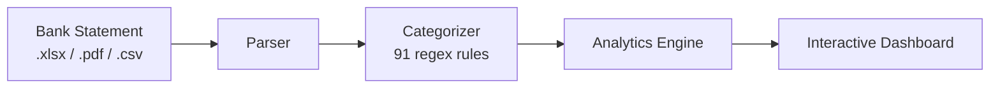

---
hide:
  - navigation
  - toc
---

# Credo Statement Analyzer

Privacy-first financial analytics for Credo Bank statements. All data stays in your browser.

  <a href="introduction/" class="btn-primary">Get Started &#8594;</a>
  <a href="https://github.com/Vlad1k3/credo-app" target="_blank" class="btn-secondary">GitHub</a>

&#x1F512;
100% Private
Your financial data never leaves your device. No server, no tracking, no accounts.

&#x1F4C8;
Deep Analytics
Income/expense trends, categories, savings rates, balance timelines, period comparisons.

&#x1F4B1;
Multi-Currency
Supports GEL, USD, EUR, RUB. Converts using historical NBG exchange rates.

&#x1F4F1;
Mobile-Ready
Responsive design with touch-friendly controls and collapsible sections.

## :material-rocket-launch: Quick Start

1. Export your statement from [Credo Bank](https://mycredo.ge) as `.xlsx` or `.pdf`
2. Open the app and drag your file(s) onto the upload area
3. Explore your financial data across All Time, Year, Month, Week, or Day views

## :material-cog: How It Works

All steps run in the browser. The only network request is fetching exchange rates from the [National Bank of Georgia API](https://nbg.gov.ge) when multi-currency accounts are detected.
