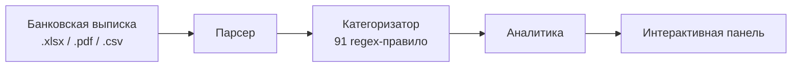

---
hide:
  - navigation
  - toc
---

# Анализатор выписок Credo

Финансовая аналитика с приоритетом конфиденциальности для выписок Credo Bank. Все данные остаются в вашем браузере.

  <a href="introduction/" class="btn-primary">Начать &#8594;</a>
  <a href="https://github.com/Vlad1k3/credo-app" target="_blank" class="btn-secondary">GitHub</a>

&#x1F512;
100% Приватно
Ваши финансовые данные никогда не покидают устройство. Без серверов, без трекинга, без аккаунтов.

&#x1F4C8;
Глубокая аналитика
Тренды доходов/расходов, категории, нормы сбережений, хронология баланса, сравнение периодов.

&#x1F4B1;
Мультивалютность
Поддержка GEL, USD, EUR, RUB. Конвертация по историческим курсам НБГ.

&#x1F4F1;
Мобильная версия
Адаптивный дизайн с удобным сенсорным управлением и сворачиваемыми секциями.

## :material-rocket-launch: Быстрый старт

1. Экспортируйте выписку из [Credo Bank](https://mycredo.ge) в формате `.xlsx` или `.pdf`
2. Откройте приложение и перетащите файл(ы) в зону загрузки
3. Исследуйте свои финансовые данные в режимах «За всё время», «Год», «Месяц», «Неделя» или «День»

## :material-cog: Как это работает

Все этапы выполняются в браузере. Единственный сетевой запрос — получение обменных курсов из [API Национального банка Грузии](https://nbg.gov.ge) при обнаружении мультивалютных счетов.
